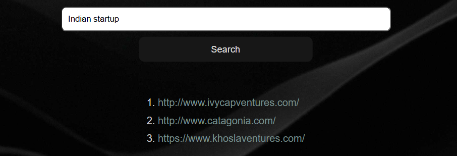

# VC-Assistant

Welcome to the VC Firm Search Tool! This tool helps you find venture capital (VC) firms based on your input. Whether you have specific phrases in mind or already have a favorite VC firm, this tool makes the search process quick and easy.

## Installation

No installation is required to use this tool. Simply access it through your web browser.

## VC-Assistant URL

The VC-Assistant is currently running at:

- [Heroku App](https://vc-assistant-6a98c041519b.herokuapp.com/)

Alternatively, you can try:

- [GitHub Dev Environment](https://supreme-space-winner-vg6777644pq2w7xg-5000.app.github.dev/)
  
## How to Use

1. **Search by Descriptive Phrases:**
   - Enter descriptive phrases related to the type of VC firm you're looking for. The tool will automatically process the input and find the closest matching VC firms.
   - **Example:** I searched for "Indian startup" and found an [Indian VC fund](http://www.ivycapventures.com/) based in Mumbai.
   
    
    

2. **Search by VC Firm Website:**
   - Input the website URL of your favorite VC firm. If the website is in the database, the tool will provide the closest matching VC firms. Otherwise, it will scrape the data, create embeddings, and save them in the database before providing results.
   - **Example:** I searched for a website, and the tool detected it was not in the database. It then scraped data (as shown in the images below), created embeddings, saved them, and found the three closest matches.
   
    
    

3. **Get Results:**
   - After submitting your input, the tool will provide you with the three closest matches to your search criteria.

## Development

This tool was developed using [Python](https://www.python.org/) and the [Flask](https://flask.palletsprojects.com/) framework. Contributions are welcome via forking the repository and submitting pull requests.

## Feedback

If you have any feedback, suggestions, or encounter any issues while using the tool, please feel free to open an issue on the [GitHub repository](https://github.com/ashotvardanya/VC-Assistant).

## License

This project is licensed under the [MIT License](LICENSE).
